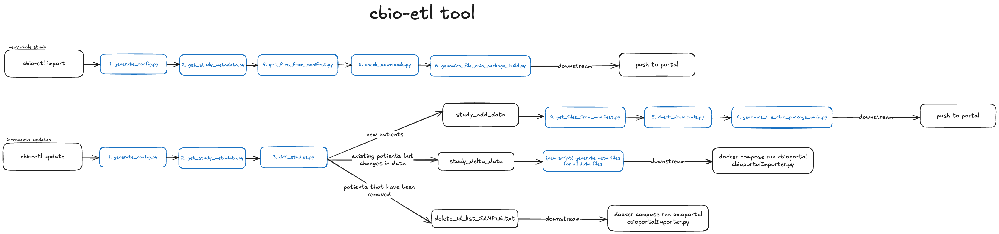

# Outline on ETL for converting data from CAVATICA and Data Warehouse to PedcBioPortal format
In general, we are creating upload packages converting our data and metadata to satisfy the requirements outlined [here](https://docs.cbioportal.org/5.1-data-loading/data-loading/file-formats).
See [below](#collaborative-and-publication-workflows) for special cases like publications or collaborative efforts
## Overview
```
usage: cbio-etl [-h] {import,update} ...

CBio ETL Command Line Tool

positional arguments:
  {import,update}
    import         Run import workflow (Steps 1, 2, 4, 5, 6)
    update         Run update workflow (Steps 1, 2, 3, 4, 5, 6)

options:
  -h, --help       show this help message and exit
```
- Use `cbio-etl import` if importing a new/whole study. [Read full SOP here](docs/WHOLE_STUDY_IMPORT.md)
- Use `cbio-etl update` if making changes to existing study (incremental updates). [Read full SOP here](docs/INCREMENTAL_UPDATES.md)

The steps in `cbio-etl import` are outlined as follows:
1. Generate config JSON
1. Get study metadata
1. Get files from manifest
1. Check downloaded files
1. Build genomic file package


## Required credentials files
- Copy the [`db.ini`](template_credentials/template.db.ini) template to `/path/to/db.ini` and replace placeholders with your credentials.
- Copy the [`sevenbridges.ini`](template_credentials/template.sevenbridges.ini) template to `~/.sevenbridges/credentials` and replace placeholders with your credentials.

### Required for running `cbio-etl update`
- Download a reusable access token for PedcBioPortal `cbioportal_data_access_token.txt` from [here](https://pedcbioportal.kidsfirstdrc.org/webAPI#using-data-access-tokens).

## Local Installation
### Software Prerequisites
+ `python3` v3.10+
+ [`bedtools`](https://bedtools.readthedocs.io/en/latest/content/installation.html)
+ `Try::Tiny` Perl module
+ [`saml2aws`](https://github.com/Versent/saml2aws) - [directions to use](https://www.notion.so/d3b/Setup-SAML-Login-1056131f1200806ba182f7b7c1793a40?pvs=4)
+ Access to [AWS Infra PedCBioPortal Import](https://github.com/d3b-center/aws-infra-pedcbioportal-import) repo for server loading
+ Access to the `postgres` D3b Warehouse database at `d3b-warehouse-aurora-prd.d3b.io`. Need at least read access to tables with the `bix_workflows` schema

[cBio load package v5.4.10](https://github.com/cBioPortal/cbioportal/releases/tag/v5.4.10) is used in this tool.
Refer to [INSTALL.md](docs/INSTALL.md) and [setup.py](setup.py) for more details.

### Installation Steps
Run on `Mgmt-Console-Dev-chopd3bprod@684194535433` EC2 instance
```sh
git clone https://github.com/kids-first/kf-cbioportal-etl.git
pip install /path/to/kf-cbioportal-etl/
```

### Usage
```sh
cbio-etl import \
    --db-ini /path/to/db.ini \
    --study pbta_pnoc \
    --sbg-profile default \
    --dgd-status kf 
  ```

## Docker Installation
### Installation Steps
```sh
docker pull pgc-images.sbgenomics.com/d3b-bixu/cbio-etl:v2.2.0
```

### Usage
```
docker run --rm -it \
    -v /path/to/db.ini:/credentials/db.ini \
    -v /path/to/cbioportal_data_access_token.txt:/credentials/cbioportal_data_access_token.txt \
    -v /path/to/.sevenbridges/credentials:/root/.sevenbridges/credentials \
    -v /path/to/output_dir:/output \
    cbio-etl /bin/bash -c "cd /output && cbio-etl update \
    --db-ini /credentials/db.ini \
    --token /credentials/cbioportal_data_access_token.txt \
    --study pbta_pnoc \
    --sbg-profile default \
    --dgd-status kf"
```

## Collaborative and Publication Workflows
These are highly specialized cases in which all or most of the data come from a third party, and therefore requires specific case-by-case protocols.

### OpenPedCan
See [OpenPedCan README](COLLABORATIONS/openTARGETS/README.md)

### OpenPBTA
See [OpenPBTA README](COLLABORATIONS/openPBTA/README.md)