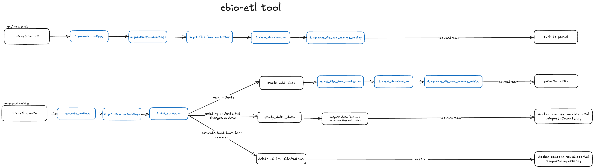

# Outline on ETL for converting data from CAVATICA and Data Warehouse to PedcBioportal format
In general, we are creating upload packages converting our data and metadata to satisfy the requirements outlined [here](https://docs.cbioportal.org/5.1-data-loading/data-loading/file-formats).
Further general loading notes can be found in this [Notion page](https://www.notion.so/d3b/Cbioportal-Study-Load-SOP-58812479fabe4d2fa9f72242e331b5ee).
See [below](#collaborative-and-publication-workflows) for special cases like publications or collaborative efforts
## Overview
```
usage: cbio-etl [-h] {import,update} ...

CBio ETL Command Line Tool

positional arguments:
  {import,update}
    import         Run import workflow (Steps 1, 2, 4, 5, 6)
    update         Run update workflow (Steps 1, 2, 3, 4, 5, 6)

options:
  -h, --help       show this help message and exit
```
- Use `cbio-etl import` if importing a new/whole study.
- Use `cbio-etl update` if making changes to existing study (incremental updates).

The steps in `cbio-etl import` are outlined as follows:
1. Generate config JSON
1. Get study metadata
1. Get files from manifest
1. Check downloaded files
1. Build genomic file package


## Required credentials files
- Copy the `credentials_templates/template.db.ini` template to `/path/to/db.ini` and replace placeholders with your credentials.
- Copy the `credentials_templates/template.sevenbridges.ini` template to `~/.sevenbridges/credentials` and replace placeholders with your credentials.

### Required for running `cbio-etl update`
- Download a reusable access token for PedcBioPortal `cbioportal_data_access_token.txt` from [here](https://pedcbioportal.kidsfirstdrc.org/webAPI#using-data-access-tokens).

## Local Installation
### Software Prerequisites
+ `python3` v3.10+
+ `bedtools` (https://bedtools.readthedocs.io/en/latest/content/installation.html)
+ `Try::Tiny` Perl module
+ `saml2aws` (https://github.com/Versent/saml2aws) [directions to use](https://www.notion.so/d3b/Setup-SAML-Login-1056131f1200806ba182f7b7c1793a40?pvs=4)
+ Access to https://github.com/d3b-center/aws-infra-pedcbioportal-import repo for server loading:
+ Access to the `postgres` D3b Warehouse database at `d3b-warehouse-aurora-prd.d3b.io`. Need at least read access to tables with the `bix_workflows` schema

[cBio load package v5.4.10](https://github.com/cBioPortal/cbioportal/releases/tag/v5.4.10) is used in this tool.
Refer to [INSTALL.md](INSTALL.md) and [setup.py](setup.py) for more details.

### Installation Steps
Run on `Mgmt-Console-Dev-chopd3bprod@684194535433` EC2 instance
```sh
git clone https://github.com/kids-first/kf-cbioportal-etl.git
pip install /path/to/kf-cbioportal-etl/
```

### Usage
```sh
cbio-etl import \
    --db-ini /path/to/db.ini \
    --study pbta_pnoc \
    --sbg-profile default \
    --dgd-status kf 
  ```

## Docker Installation
### Installation Steps
```sh
docker pull pgc-images.sbgenomics.com/d3b-bixu/cbio-etl:2.2.0
```

### Usage
```
docker run --rm -it \
    -v /path/to/db.ini:/credentials/db.ini \
    -v /path/to/cbioportal_data_access_token.txt:/credentials/cbioportal_data_access_token.txt \
    -v /path/to/.sevenbridges/credentials:/root/.sevenbridges/credentials \
    -v /path/to/output_dir:/output \
    cbio-etl /bin/bash -c "cd /output && cbio-etl update \
    --db-ini /credentials/db.ini \
    --token /credentials/cbioportal_data_access_token.txt \
    --study pbta_pnoc \
    --sbg-profile default \
    --dgd-status kf"
```

## Run manually without tool installation
Below assumes you have already created the necessary tables from dbt
1. Run commands as outlined in [scripts/get_study_metadata.py](#scriptsget_study_metadatapy). Copy/move those files to the cBio loader ec2 instance
1. Recommended, but not required: run [scripts/diff_studies.py](docs/DIFF_STUDY_CLINICAL.md). It will give a summary of metadata changes between what is currently loaded and what you plan to load, to potentially flag any suspicious changes
Also will output delta files and ID changes lists for server incremental upload functionality
1. Copy over the appropriate aws account key and download files. Example using `pbta_all` study:

   ```sh
    python3 cbioportal_etl/scripts/get_files_from_manifest.py -s turbo -m cbio_file_name_id.txt -r
   ```
    `aws_bucket_key_pairs.txt` is a headerless tsv file with bucket name + object prefixes and aws profile name pairs
1. Copy and edit `cbioportal_etl/STUDY_CONFIGS/pbta_all_data_processing_config.json` and `cbioportal_etl/STUDY_CONFIGS/pbta_all_case_meta_config.json` as needed
1. Run pipeline script - ignore manifest section, it is a placeholder for a better function download method

   ```sh
   cbioportal_etl/scripts/genomics_file_cbio_package_build.py -t cbio_file_name_id.txt -c pbta_all_case_meta_config.json -d pbta_all_data_processing_config.json -f both
   ```
1. Check logs and outputs for errors, especially `validator.errs` and `validator.out`, assuming everything else went fine, to see if any `ERROR` popped up that would prevent the pakcage from loading properly once pushed to the bucket and Jenkins import job is run

### Final output example

In the end, if you named your output dir `processed`, you'll end up with this example output from `pbta_all` study:
```sh
processed
└── pbta_all
    ├── case_lists
│   ├── cases_3way_complete.txt
│   ├── cases_RNA_Seq_v2_mRNA.txt
│   ├── cases_all.txt
│   ├── cases_cna.txt
│   ├── cases_cnaseq.txt
│   ├── cases_sequenced.txt
│   └── cases_sv.txt
├── data_CNA.txt -> /home/ubuntu/volume/PORTAL_LOADS/pbta_all/merged_cnvs/pbta_all.discrete_cnvs.txt
├── data_clinical_patient.txt -> /home/ubuntu/volume/PORTAL_LOADS/pbta_all/datasheets/data_clinical_patient.txt
├── data_clinical_sample.txt -> /home/ubuntu/volume/PORTAL_LOADS/pbta_all/datasheets/data_clinical_sample.txt
├── data_clinical_timeline_clinical_event.txt -> /home/ubuntu/volume/PORTAL_LOADS/pbta_all/datasheets/data_clinical_timeline_clinical_event.txt
├── data_clinical_timeline_imaging.txt -> /home/ubuntu/volume/PORTAL_LOADS/pbta_all/datasheets/data_clinical_timeline_imaging.txt
├── data_clinical_timeline_specimen.txt -> /home/ubuntu/volume/PORTAL_LOADS/pbta_all/datasheets/data_clinical_timeline_specimen.txt
├── data_clinical_timeline_surgery.txt -> /home/ubuntu/volume/PORTAL_LOADS/pbta_all/datasheets/data_clinical_timeline_surgery.txt
├── data_clinical_timeline_treatment.txt -> /home/ubuntu/volume/PORTAL_LOADS/pbta_all/datasheets/data_clinical_timeline_treatment.txt
├── data_cna.seg.txt -> /home/ubuntu/volume/PORTAL_LOADS/pbta_all/merged_cnvs/pbta_all.merged_seg.txt
├── data_linear_CNA.txt -> /home/ubuntu/volume/PORTAL_LOADS/pbta_all/merged_cnvs/pbta_all.predicted_cnv.txt
├── data_mutations_extended.txt -> /home/ubuntu/volume/PORTAL_LOADS/pbta_all/merged_mafs/pbta_all.maf
├── data_rna_seq_v2_mrna.txt -> /home/ubuntu/volume/PORTAL_LOADS/pbta_all/merged_rsem/pbta_all.rsem_merged.txt
├── data_rna_seq_v2_mrna_median_Zscores.txt -> /home/ubuntu/volume/PORTAL_LOADS/pbta_all/merged_rsem/pbta_all.rsem_merged_zscore.txt
├── data_sv.txt -> /home/ubuntu/volume/PORTAL_LOADS/pbta_all/merged_fusion/pbta_all.fusions.txt
├── meta_CNA.txt
├── meta_clinical_patient.txt
├── meta_clinical_sample.txt
├── meta_clinical_timeline_clinical_event.txt
├── meta_clinical_timeline_imaging.txt
├── meta_clinical_timeline_specimen.txt
├── meta_clinical_timeline_surgery.txt
├── meta_clinical_timeline_treatment.txt
├── meta_cna.seg.txt
├── meta_linear_CNA.txt
├── meta_mutations_extended.txt
├── meta_rna_seq_v2_mrna.txt
├── meta_rna_seq_v2_mrna_median_Zscores.txt
├── meta_study.txt
└── meta_sv.txt
```
Note! Most other studies won't have a timeline set of files.
### Upload the final packages
Upload all of the directories named as study short names to `s3://kf-strides-232196027141-cbioportal-studies/studies/`. You may need to set and/or copy your aws saml key before uploading. See "access to https://github.com/d3b-center/aws-infra-pedcbioportal-import repo" bullet point in [Software Prerequisites](#software-prerequisites) to load the study.
### Load into QA/PROD
An AWS step function exists to load studies on to the QA and PROD servers.
  + Create a branch in the `d3b-center/aws-infra-pedcbioportal-import` git repo (**MUST START WITH `feature/`**) and edit the `import_studies.txt` file with the study name you which to load. Can be an MSKCC datahub link or a local study name
  + Push the branch to remote - this will kick off a github action to load into QA
  + To load into prod, make a PR. On merge, load to prod will kick off
  + aws `stateMachinePedcbioImportservice` Step function service is used to view and manage running jobs
  + To repeat a load, click on the ▶️ icon in the git repo to select the job you want to re-run
  + *Note*, if your branch importStudies.txt is the same as main, you may have tot rigger it yourself. To do so, go to [actions](https://github.com/d3b-center/aws-infra-pedcbioportal-import/actions), on the left panel choose which action you want, then from the drop down in the right panel, pick which branch you want that action to run on 
## Details - ETL Steps
Use this section as a reference in case your overconfidence got the best of you

### REFS
In case you want to use different reference inputs...
 - From data_processing_config.json `bed_genes`:
   - This is used to collate ControlFreeC results into gene hits
   - For VEP 105, gtf was downloaded from `https://ftp.ensembl.org/pub/release-105/gtf/homo_sapiens/Homo_sapiens.GRCh38.105.chr.gtf.gz`
   - Then, using bedops and a perl-one-liner: 
   ```sh
   cat Homo_sapiens.GRCh38.105.chr.gtf | perl -e 'while(<>){@a=split /\t/; if($a[2] eq "gene" && $a[8] =~ /gene_name/){print $_;}}'  | convert2bed -i gtf --attribute-key=gene_name  > Homo_sapiens.GRCh38.105.chr.gtf_genes.bed
   ```
To get aws bucket prefixes to add key (meaning aws profile names) to:
```sh
cat *genomic* | cut -f 15 | cut -f 1-3 -d "/" | sort | uniq > aws_bucket_key_pairs.txt
```
Just remove the `s3_path` and `None` entries

### Starting file inputs
Most starting files are exported from the D3b Warehouse. An example of file exports can be found here `cbioportal_etl/scripts/export_clinical.sh`, we now use `cbioportal_etl/scripts/get_study_metadata.py` to get the files.
However, a python wrapper script that leverages the `x_case_meta_config.json` is recommended to use for each study.

### cbioportal_etl/scripts/get_study_metadata.py
```
usage: get_study_metadata.py [-h] [-d DB_INI] [-p PROFILE] [-c CONFIG_FILE]

Pull clinical data and genomics file etl support from D3b data warehouse.

optional arguments:
  -h, --help            show this help message and exit
  -d DB_INI, --db-ini DB_INI
                        Database config file - formatting like aws or sbg creds
  -p PROFILE, --profile PROFILE
                        ini profile name
  -c CONFIG_FILE, --config CONFIG_FILE
                        json config file with meta information; see REFS/pbta_all_case_meta_config.json example
  -r REF_DIR, --ref-dir REF_DIR
                        dir name containing template data_clinical* header files
```

### From D3b Warehouse
#### - Data clinical sample sheet
This is the cBioportal-formatted sample sheet that follows guidelines from [here](https://docs.cbioportal.org/5.1-data-loading/data-loading/file-formats#clinical-sample-columns)

#### - Data clinical patient sheet
This is the cBioportal-formatted patient sheet that follows guidelines from [here](https://docs.cbioportal.org/5.1-data-loading/data-loading/file-formats#clinical-patient-columns)

#### - Genomics metadata file
Seemingly redundant, this file contains the file locations, BS IDs, file type, and cBio-formatted sample IDs of all inputs.
It helps simplify the process to integrate better into the downstream tools.
This is the file that goes in as the `-t` arg in all the data collating tools

### User-edited
#### - Data processing config file

This is a json formatted file that has tool paths, reference paths, and run time params.
An example is given in `cbioportal_etl/STUDY_CONFIGS/pbta_all_data_processing_config.json`.
This section here:
```json
  "file_loc_defs": {
    "_comment": "edit the values based on existing/anticipated source file locations, relative to working directory of the script being run",
    "mafs": {
      "kf": ["annotated_public_outputs", "consensus_public_outputs","mutect2_public_outputs"],
      "dgd": "annotated_public",
      "header": "/home/ubuntu/tools/kf-cbioportal-etl/REFS/maf_KF_CONSENSUS_r105.txt"
    },
    "cnvs": {
      "pval": "ctrlfreec_pval",
      "info": "ctrlfreec_info",
      "seg": "ctrlfreec_bam_seg"
    },
    "rsem": "RSEM_gene",
    "fusion": "annofuse_filtered_fusions_tsv",
    "dgd_fusion": "fusion-dgd.tsv.gz"
  },
```
Will likely need the most editing existing based on your input, and should only need to updated if something changes after initial load.

#### - Metadata processing config file

This is a json config file with file descriptions and case lists required by the cbioportal.
An example is given in `cbioportal_etl/STUDY_CONFIGS/pbta_all_case_meta_config.json`.
Within this file is a `_doc` section with a decent explanation of the file format and layout.
Be sure to review all data types to be loaded by review all `meta_*` to see if they match incoming data.
Likely personalized edits would occur in the following fields:
+ `merged_{data type}`: The `profile_description` key in each is a good place to describe any algorithm or nuances used to generate the data of that type. Also be sure to remove any data types not being loaded, as that determines what genomic file collation steps are run.
+ `study`: Here is where you set the overall study description, it's the banner text that people will see in the study overview page that gives them a sense of what the data is.
  + `description`: This field is set up as an array so that a generic form of "text describing" "disease" "more text describing" can be used. Put another way, element one is whatever you want to say about the disease/study until you are ready to mention the disease/study, element two anything you may optionally wish to add
  + `groups`: These are access groups defined is cBioportal.  Default is `PUBLIC`, but another can be named is restrictions are needed.  Need to work with Devops for custom groups
  + `cancer_study_identifier`: This is the short name that you create for the study.  It will be the name of the study load folder and will be used by cBioportal to find all relevant information for that study.
  + `type_of_cancer`: This is the oncotree code used to categorize the study to a disease type that best summarizes all samples in the study. These are the default codes: http://oncotree.mskcc.org/#/home. Internally, we have added `phgg` and `plgg`. If your study doesn't fit, propose a new one to be added
  + `display_name`: This is what will show as a long form title on the site home page
  + `short_name`: This is the short version. By default, should be the same as `cancer_study_identifier`


### Pipeline script
After downloading the genomic files and files above as needed, and properly editing config files as needed, this script should generate and validate the cBioportal load package

### cbioportal_etl/scripts/get_files_from_manifest.py
Currently, file locations are still too volatile to trust to make downloading part of the pipeline. Using various combinations of buckets and sbg file ID pulls will eventually get you everything
```
usage: get_files_from_manifest.py [-h] [-m MANIFEST] [-f FTS] [-p PROFILE] [-s SBG_PROFILE] [-c CBIO] [-a] [-d]

Get all files for a project.

optional arguments:
  -h, --help            show this help message and exit
  -m MANIFEST, --manifest-list MANIFEST
                        csv list of of genomic file location manifests
  -f FTS, --file-types FTS
                        csv list of workflow types to download
  -t AWS_TBL, --aws-tbl AWS_TBL
                        Table with bucket name and keys to subset on
  -s SBG_PROFILE, --sbg-profile SBG_PROFILE
                        sbg profile name. Leave blank if using AWS instead
  -c CBIO, --cbio CBIO  Add cbio manifest to limit downloads
  -a, --active-only     Set to grab only active files. Recommended.
  -r, --rm-na           Remove entries where file_id and s3_path are NA. Useful for studies (like pbta_all) with external files not to be downloaded when using cbio_file_name input file as
                        manifest
  -d, --debug           Just output manifest subset to see what would be grabbed
  -o, --overwrite       If set, overwrite if file exists
```
### cbioportal_etl/scripts/genomics_file_cbio_package_build.py
```
usage: genomics_file_cbio_package_build.py [-h] [-t TABLE] [-m MANIFEST] [-c CBIO_CONFIG] [-d DATA_CONFIG] [-f [{both,kf,dgd}]]

Download files (if needed), collate genomic files, organize load package.

optional arguments:
  -h, --help            show this help message and exit
  -t TABLE, --table TABLE
                        Table with cbio project, kf bs ids, cbio IDs, and file names
  -m MANIFEST, --manifest MANIFEST
                        Download file manifest, if needed
  -c CBIO_CONFIG, --cbio-config CBIO_CONFIG
                        cbio case and meta config file
  -d DATA_CONFIG, --data-config DATA_CONFIG
                        json config file with data types and data locations
  -f [{both,kf,dgd}], --dgd-status [{both,kf,dgd}]
                        Flag to determine load will have pbta/kf + dgd(both), kf/pbta only(kf), dgd-only(dgd)
  -l, --legacy          If set, will run legacy fusion output
```
+ `-t` would be the [Genomics metadata file](#genomics-metadata-file)
+ `-c` would be the [Metadata processing config file](#metadata-processing-config-file)
+ `-d` would be the [Data processing config file](#data-processing-config-file)

Check the pipeline log output for any errors that might have occurred.


### Congratulations, you did it!

## Collaborative and Publication Workflows
These are highly specialized cases in which all or most of the data come from a third party, and therefore requires specific case-by-case protocols.

### OpenPedCan
See [OpenPedCan README](COLLABORATIONS/openTARGETS/README.md)

### OpenPBTA
See [OpenPBTA README](COLLABORATIONS/openPBTA/README.md)
