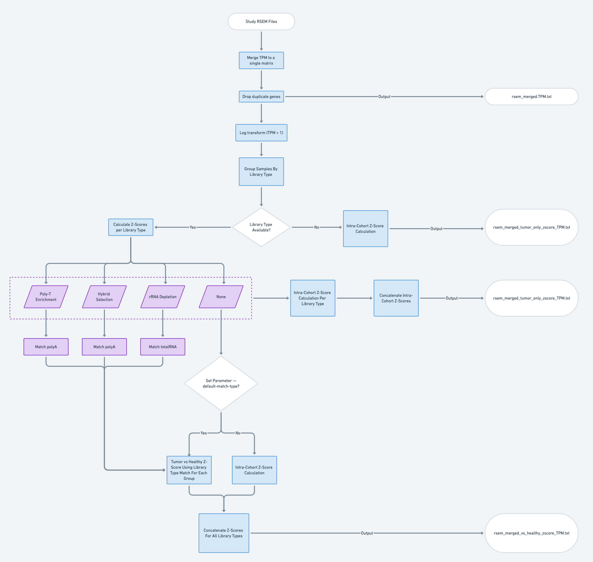

# RNA-Seq Expression and Z-Score Calculation
This document outlines how RNA-seq gene expression values are processed and transformed into z-scores for cBioPortal-compatible analysis using the [RNA merge script](../cbioportal_etl/scripts/rna_merge_rename_expression.py).

## Overview
The script performs the following key tasks:
1. Merges multiple RSEM gene expression files into a single matrix. Default expression is TPM, but FPKM can be chosen as a parameter
1. Maps internal biospedimen IDs to cBioPortal sample names
1. Converts gene symbols to Hugo, filters out duplicate gene symbols
1. Applies log transformation (log2(TPM + 1))
1. Calculates z-scores per gene across all samples in the cohort
1. Outputs:
    1. merged TPM matrix
    1. Intra-cohort z-scores
    1. Tumor vs reference z-scores (if available)

## TPM Merging
Each RSEM file for a study is loaded and the TPM columns are concatenated into a single wide-format matrix with `gene_id` as index.

## Representative Gene Transcript Selection
For RSEM files that include multiple rows per gene symbol, only the transcript with the highest mean expression across all samples is kept.

## Log Transformation
All TPM values are transformed using log2(TPM + 1), which is used to generate z-score-normalized values.

## Z-Score Calculation
Z-scores are calculated to normalize gene expression levels across samples. The input RSEM files generated from RNA-Seq pipelines generally includes metadata about:
- Experimental strategy: DNA or RNA-Seq
- Library type: only available for RNA-Seq samples, including hybrid selection (exome capture), poly-t enrichment (poly), and rRNA depletion (totalRNA)

There are two modes of z-score calculation:

### Intra-Cohort Z-Scores
When it is used:
- If library type is null for a sample
- If no matching health reference exists for a given RNA library type
- If the `--default-match-type` argument is not set

How it is calculated: 
- Z-scores are calculated within the tumor cohort itself
- For each gene, the mean and standard deviation are calculated across all tumor samples of the same RNA library type (or across all samples if the library type is missing)
- Each sample's gene expression is then z-transformed: Z = (x - μ) / σ
    where: 
    - x is the log2(TPM + 1) of the gene
    - μ and σ are the mean and standard deviation of the gene across all intra-cohort samples

### Tumor vs (Healthy) Reference Z-Score
When it is used: 
- If library type is present and matches a known RNA library type:
    - Poly-T Enrichment or Hybrid Selection -> polyA-matched healthy reference
    - rRNA Depletion -> totalRNA-matched healthy reference
- If `--default-match-type` is provided (e.g., `--default-match-type polyA`), this fallback is used for samples with unknown library type

How it's calculated:
- Pre-processed healthy reference matrices are loaded from a compressed archive 
- samples are grouped by library type
- For each gene shared between tumor and healthy datasets: Z = (x - μ) / σ
    where:
    - x is the tumor expression value
    - μ and σ are computed from the healthy cohort
- If no healthy reference can be matched for a library type, intra-cohort z-scores are used instead

## Postprocessing
Any `NaN` values (genes with no variance) are replaced with 0.ee